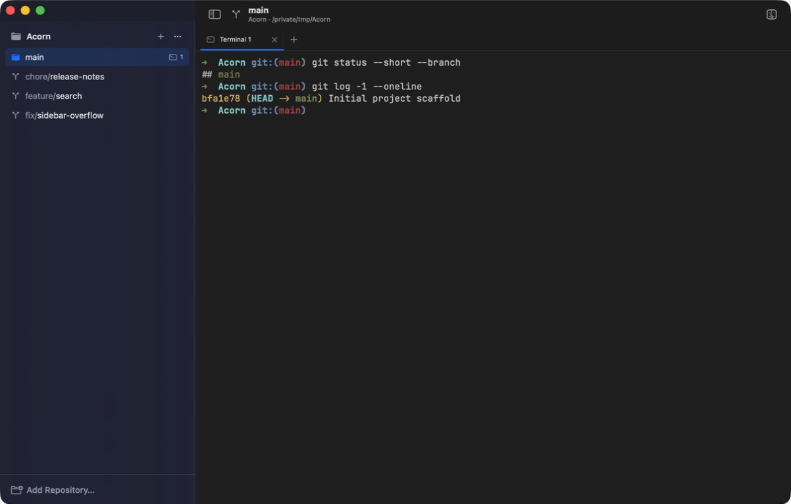
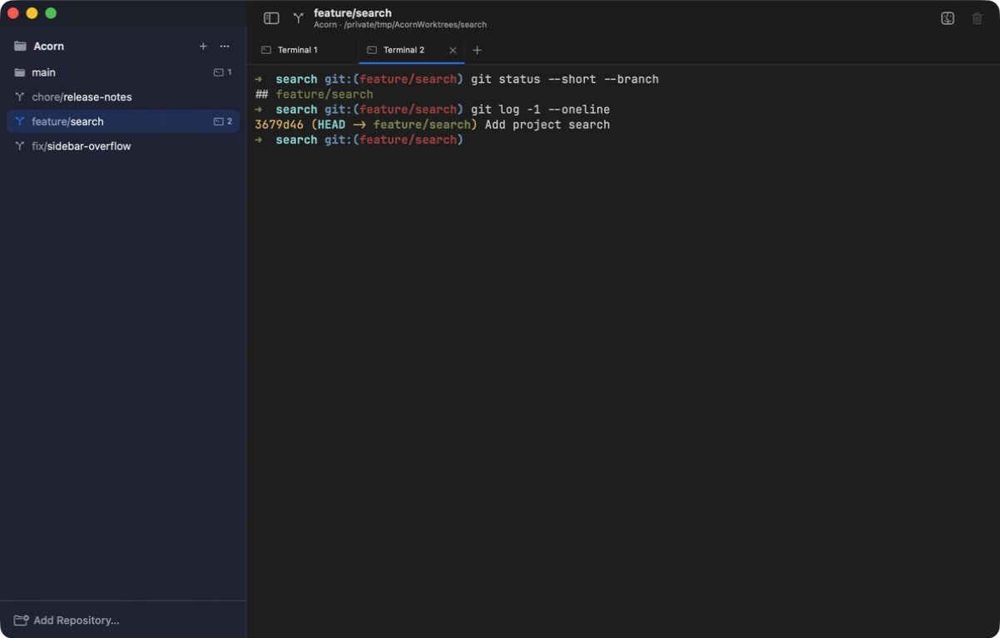

<div align="center">
  

# Tamarin

Swing between (work)trees

[](https://github.com/mbokinala/tamarin)
[](https://www.swift.org/)

</div>





## Features

- Add repositories and browse their registered worktrees in one sidebar.
- Create worktrees from local or remote branches, or create a new branch from any existing ref.
- Open multiple [Ghostty](https://github.com/ghostty-org/ghostty)-based terminal tabs for each worktree.
- Set a worktree directory plus setup and teardown scripts for each repository.

## Worktree lifecycle scripts

Repository Settings can define a setup script that runs after Tamarin creates a worktree and a teardown script that runs before Tamarin removes one. Tamarin saves both scripts in the primary checkout at `.tamarin/config.toml`:

```toml
[scripts]
setup = '''
npm install
cp "$TAMARIN_REPO_DIR/.env" "$TAMARIN_WORKTREE_DIR/.env"
'''

teardown = '''
docker compose down
'''
```

Both scripts run from an interactive login `zsh`, with the worktree as the current directory. This loads the same shell startup files that normally add tools such as nvm-managed `npm` to `PATH`. Scripts should still avoid prompts because Tamarin does not provide interactive input. They can use these environment variables:

- `TAMARIN_REPO_DIR`: the primary checkout containing `.tamarin/config.toml`.
- `TAMARIN_WORKTREE_DIR`: the worktree being created or removed.

If setup fails, Tamarin keeps the newly created worktree and reports the error. If teardown fails, Tamarin stops and does not remove the worktree.

Whenever a setup script runs, Tamarin immediately opens a read-only **Setup Output** terminal tab and streams standard output and standard error into it. The tab shows the final exit status, and the ordinary interactive terminal becomes available in the adjacent tab when setup finishes.

## Installation

Tamarin requires macOS 14 or later and Git at `/usr/bin/git`.

Download a published signed build from [GitHub Releases](https://github.com/mbokinala/tamarin/releases/latest). If no build is available, build Tamarin from source.

Tamarin uses Sparkle to install later updates. Use **Tamarin > Check for Updates…** to start a manual update check.

## Build from source

1. Clone this repository.
2. Open `Tamarin.xcodeproj` in Xcode.
3. Wait for Xcode to resolve the Swift package dependencies.
4. Select the Tamarin scheme.
5. Build and run the app.
